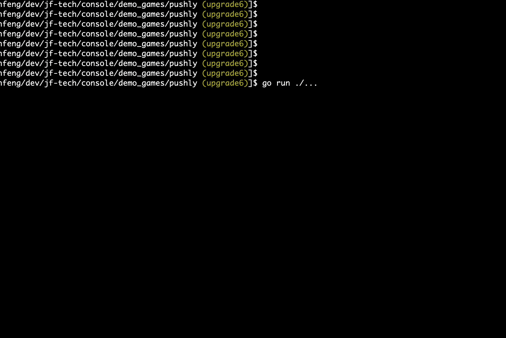
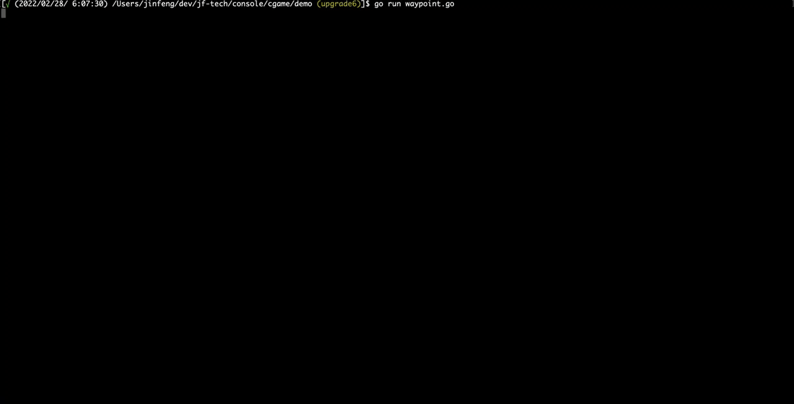
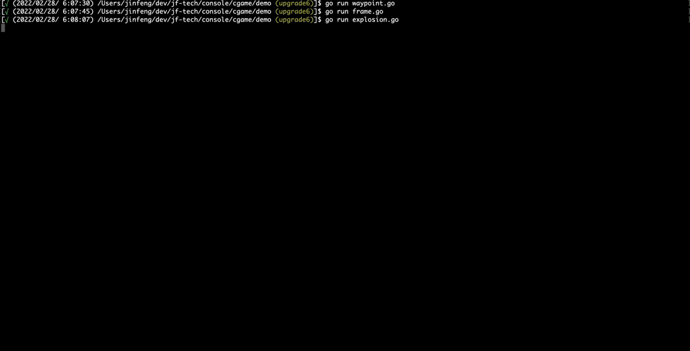

# Terminal/Console Window System, Game Engine, and Games

### Completed demo games:
- 1942

- Tetris

- Pushly (Sokoban)

### Game engine `cgame` demos:

- Gravity (Gravity Animation + Collision Detection)

- Particle (Collision Detection)

- Waypoint Animation

- Explosion Animation

- Frame Animation

### Games In progress:
- Super Fario (remake of Super Mario)
- Tank 1990

WIP
